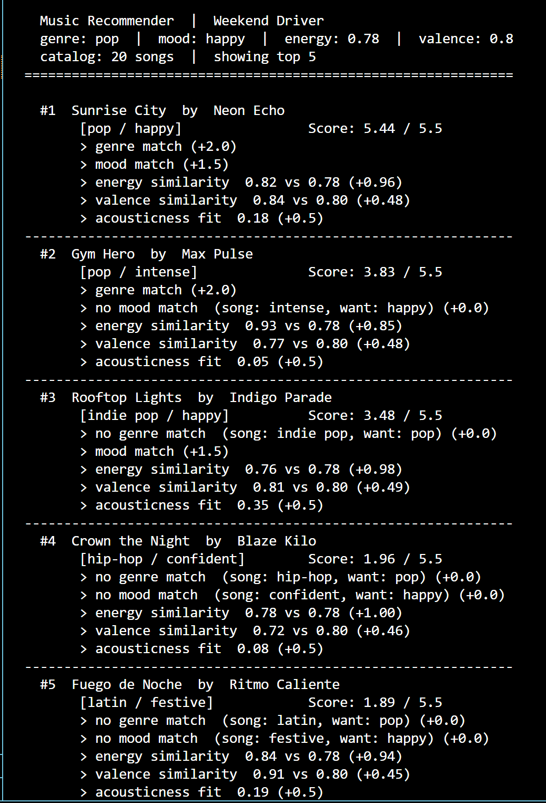
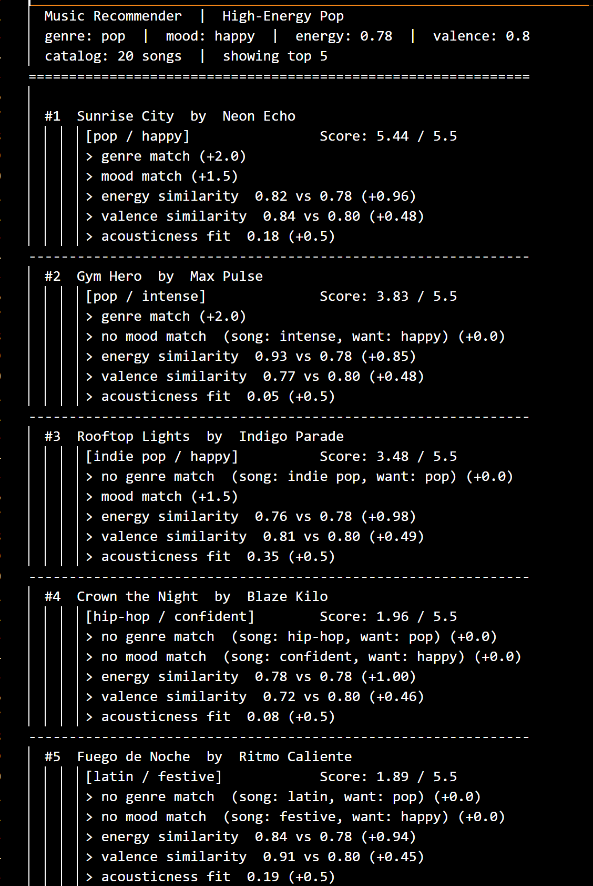

# 🎵 Music Recommender Simulation

## Project Summary

In this project you will build and explain a small music recommender system.

Your goal is to:

- Represent songs and a user "taste profile" as data
- Design a scoring rule that turns that data into recommendations
- Evaluate what your system gets right and wrong
- Reflect on how this mirrors real world AI recommenders

This simulation builds a content-based music recommender that scores songs against a user's taste profile using weighted feature comparisons. Given a user's preferred mood, energy level, and production style, the system ranks a small catalog of songs and explains why each recommendation was made.

---

## How The System Works

Real-world recommenders like Spotify and YouTube combine two strategies: collaborative filtering, which finds patterns across millions of users' listening histories, and content-based filtering, which analyzes the audio attributes of the songs themselves. This simulation focuses on the content-based approach. Rather than asking "what do people like you enjoy?", it asks "how closely does this song's sound match what you told us you want?" Each song is scored by comparing its numerical features — energy, valence, acousticness — against the user's stated preferences using proximity math (the closer the values, the higher the score), then adding bonus points for exact matches on categorical labels like mood and genre. Songs are ranked by total score and the top results are returned with a plain-language explanation. The system prioritizes emotional feel over genre label, because two songs can share a near-identical vibe while belonging to entirely different genres.

### Algorithm Recipe

Each song is assigned a total score (maximum **5.5 points**) built from five components:

| Step | Feature | Points | Formula |
|---|---|---|---|
| 1 | Genre match | +2.0 | Fixed bonus if `song.genre == user.favorite_genre` |
| 2 | Mood match | +1.5 | Fixed bonus if `song.mood == user.favorite_mood` |
| 3 | Energy similarity | +0.0 – 1.0 | `(1 − \|user.target_energy − song.energy\|) × 1.0` |
| 4 | Valence similarity | +0.0 – 0.5 | `(1 − \|user.target_valence − song.valence\|) × 0.5` |
| 5 | Acousticness fit | +0.5 | Fixed bonus if `user.likes_acoustic` aligns with `song.acousticness` |

Songs are sorted by total score descending and the top `k` are returned.

**Why these weights?** Genre is the most deliberate user choice — it eliminates the largest slice of the catalog — so it earns the highest fixed bonus. Mood is almost as intentional (it's the emotional *reason* someone picks music) and is given +1.5 rather than +1.0 so it can occasionally outweigh a genre mismatch when the emotional fit is perfect. Energy and valence use continuous similarity so every song contributes something rather than getting a binary pass/fail.

### Known Biases and Limitations

- **Genre over-dominance.** A +2.0 genre bonus means any genre match automatically outscores a non-matching song unless that song nails mood, energy, valence, *and* acousticness simultaneously. Great songs outside the preferred genre may never surface.
- **Mood label rigidity.** Moods are exact-match strings. A user who wants "chill" receives zero mood credit for a song tagged "relaxed" or "peaceful," even though those are nearly synonymous.
- **Cold-start assumption.** The system requires the user to specify a `target_energy` and `target_valence` as precise floats. Real users describe preferences in words, not decimals; any mismatch between what they say and what gets entered degrades all continuous scores.
- **Catalog bias.** The 20-song dataset over-represents certain genres (lofi has 3 entries; metal, edm, and classical have 1 each). Users who prefer under-represented genres have fewer candidates to score well, making their top-k results feel thinner.
- **No diversity enforcement.** The ranking is purely score-based, so the top 5 could be five near-identical songs that all score 4.8+ — high accuracy but low variety.

### Song Features

| Feature | Type | Role in scoring |
|---|---|---|
| `genre` | categorical | +2.0 fixed bonus on exact match — primary filter |
| `mood` | categorical | +1.5 fixed bonus on exact match — emotional intent signal |
| `energy` | float 0–1 | Continuous similarity score, up to +1.0 |
| `valence` | float 0–1 | Continuous similarity score, up to +0.5 |
| `acousticness` | float 0–1 | +0.5 bonus when it aligns with `likes_acoustic` |
| `tempo_bpm` | integer | Stored; not used in scoring (highly correlated with energy) |
| `danceability` | float 0–1 | Stored; available for future experiments |

### UserProfile Fields

| Field | Type | How it is used |
|---|---|---|
| `favorite_genre` | string | Matched against `song.genre` for a categorical bonus |
| `favorite_mood` | string | Matched against `song.mood` for the largest categorical bonus |
| `target_energy` | float 0–1 | Compared to `song.energy` using `1 - \|diff\|` proximity scoring |
| `likes_acoustic` | bool | `True` rewards high acousticness; `False` rewards low acousticness |

---

## Getting Started

### Setup

1. Create a virtual environment (optional but recommended):

   ```bash
   python -m venv .venv
   source .venv/bin/activate      # Mac or Linux
   .venv\Scripts\activate         # Windows

2. Install dependencies

```bash
pip install -r requirements.txt
```

3. Run the app:

```bash
python -m src.main
```

### Running Tests

Run the starter tests with:

```bash
pytest
```

You can add more tests in `tests/test_recommender.py`.

---

## Experiments You Tried

Use this section to document the experiments you ran. For example:

- What happened when you changed the weight on genre from 2.0 to 0.5
- What happened when you added tempo or valence to the score
- How did your system behave for different types of users

---

## Limitations and Risks

Summarize some limitations of your recommender.

Examples:

- It only works on a tiny catalog
- It does not understand lyrics or language
- It might over favor one genre or mood

You will go deeper on this in your model card.

---

## Reflection

Read and complete `model_card.md`:

[**Model Card**](model_card.md)

Write 1 to 2 paragraphs here about what you learned:

- about how recommenders turn data into predictions
- about where bias or unfairness could show up in systems like this


---

## 7. `model_card_template.md`

Combines reflection and model card framing from the Module 3 guidance. :contentReference[oaicite:2]{index=2}  

```markdown
# 🎧 Model Card - Music Recommender Simulation

## 1. Model Name

Give your recommender a name, for example:

> VibeFinder 1.0

---

## 2. Intended Use

- What is this system trying to do
- Who is it for

Example:

> This model suggests 3 to 5 songs from a small catalog based on a user's preferred genre, mood, and energy level. It is for classroom exploration only, not for real users.

---

## 3. How It Works (Short Explanation)

Describe your scoring logic in plain language.

- What features of each song does it consider
- What information about the user does it use
- How does it turn those into a number

Try to avoid code in this section, treat it like an explanation to a non programmer.

---

## 4. Data

Describe your dataset.

- How many songs are in `data/songs.csv`
- Did you add or remove any songs
- What kinds of genres or moods are represented
- Whose taste does this data mostly reflect

---

## 5. Strengths

Where does your recommender work well

You can think about:
- Situations where the top results "felt right"
- Particular user profiles it served well
- Simplicity or transparency benefits

---

## 6. Limitations and Bias

Where does your recommender struggle

Some prompts:
- Does it ignore some genres or moods
- Does it treat all users as if they have the same taste shape
- Is it biased toward high energy or one genre by default
- How could this be unfair if used in a real product

---

## 7. Evaluation

How did you check your system

Examples:
- You tried multiple user profiles and wrote down whether the results matched your expectations
- You compared your simulation to what a real app like Spotify or YouTube tends to recommend
- You wrote tests for your scoring logic

You do not need a numeric metric, but if you used one, explain what it measures.

---

## 8. Future Work

If you had more time, how would you improve this recommender

Examples:

- Add support for multiple users and "group vibe" recommendations
- Balance diversity of songs instead of always picking the closest match
- Use more features, like tempo ranges or lyric themes

---

## 9. Personal Reflection

A few sentences about what you learned:

- What surprised you about how your system behaved
- How did building this change how you think about real music recommenders
- Where do you think human judgment still matters, even if the model seems "smart"

- Screenshot of recommendations (single run)


- Profile recs — top-5 results for each of the six user profiles

**High-Energy Pop** (`pop / happy / energy 0.78`)


```
#1  Sunrise City     [pop / happy]       Score: 5.44 / 5.5  genre+mood match
#2  Gym Hero         [pop / intense]     Score: 3.83 / 5.5  genre match only
#3  Rooftop Lights   [indie pop / happy] Score: 3.48 / 5.5  mood match only
#4  Crown the Night  [hip-hop/confident] Score: 1.96 / 5.5  energy+acousticness only
#5  Fuego de Noche   [latin / festive]   Score: 1.89 / 5.5  energy+acousticness only
```

**Chill Lofi** (`lofi / chill / energy 0.38`)


```
#1  Library Rain        [lofi / chill]    Score: 5.47 / 5.5  genre+mood+perfect valence
#2  Midnight Coding     [lofi / chill]    Score: 5.44 / 5.5  genre+mood match
#3  Focus Flow          [lofi / focused]  Score: 3.98 / 5.5  genre match only
#4  Spacewalk Thoughts  [ambient / chill] Score: 3.38 / 5.5  mood match only
#5  Coffee Shop Stories [jazz / relaxed]  Score: 1.94 / 5.5  energy+acousticness only
```

**Deep Intense Rock** (`rock / intense / energy 0.90`)


```
#1  Storm Runner    [rock / intense]  Score: 5.41 / 5.5  genre+mood match
#2  Gym Hero        [pop / intense]   Score: 3.41 / 5.5  mood match only
#3  Crown the Night [hip-hop/confid.] Score: 1.84 / 5.5  energy+acousticness only
#4  Drop the World  [edm / euphoric]  Score: 1.83 / 5.5  energy+acousticness only
#5  Sunrise City    [pop / happy]     Score: 1.82 / 5.5  energy+acousticness only
```

**Conflicted Soul** *(adversarial)* — `lofi / sad / energy 0.90 / likes_acoustic`


```
#1  Midnight Coding  [lofi / chill]     Score: 3.34 / 5.5  genre wins; mood+energy miss
#2  Focus Flow       [lofi / focused]   Score: 3.31 / 5.5  genre wins; mood+energy miss
#3  Library Rain     [lofi / chill]     Score: 3.25 / 5.5  genre wins; mood+energy miss
#4  Drift Apart      [dream pop / sad]  Score: 2.58 / 5.5  mood match; no genre/acoustic
#5  Blue Hour        [blues/melanchol.] Score: 1.45 / 5.5  nothing matches well
Observation: contradiction between high-energy and lofi/acoustic caps best score at 3.34.
The only "sad" song (Drift Apart) lands at #4 because it loses the genre and acoustic bonus.
```

**Genre Ghost** *(adversarial)* — `country / nostalgic` (genre absent from catalog)


```
#1  Porch Light          [folk/nostalgic] Score: 3.45 / 5.5  mood match saves it
#2  Library Rain         [lofi / chill]   Score: 2.00 / 5.5  perfect energy+valence fit
#3  Focus Flow           [lofi / focused] Score: 1.94 / 5.5  near-perfect energy fit
#4  Coffee Shop Stories  [jazz / relaxed] Score: 1.93 / 5.5  energy+acousticness fit
#5  Midnight Coding      [lofi / chill]   Score: 1.91 / 5.5  energy+acousticness fit
Observation: without genre bonus, #2-#5 are nearly tied (2.00→1.91); numeric features
alone are meaningful but not decisive.
```

**The Maximizer** *(adversarial)* — `edm / euphoric / energy 1.0 / valence 1.0`


```
#1  Drop the World  [edm / euphoric]  Score: 5.39 / 5.5  genre+mood+ceiling energy
#2  Gym Hero        [pop / intense]   Score: 1.81 / 5.5  energy fit only
#3  Fuego de Noche  [latin / festive] Score: 1.79 / 5.5  energy+valence+acoustic fit
#4  Sunrise City    [pop / happy]     Score: 1.74 / 5.5  energy+acousticness fit
#5  Rooftop Lights  [indie pop/happy] Score: 1.67 / 5.5  energy+acousticness fit
Observation: no NaN/overflow at boundary values; scoring degrades gracefully. Cliff
from #1 (5.39) to #2 (1.81) exposes catalog depth problem for under-represented genres.
```
