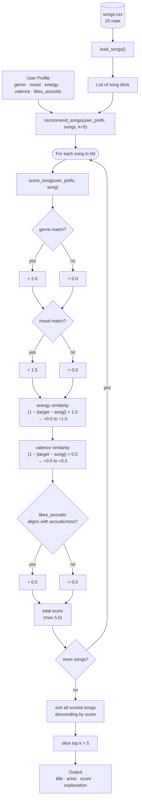

# Music Recommender — Data Flow

## Scoring weights

| Feature | Points | Type |
|---|---|---|
| Genre match | +2.0 | fixed bonus |
| Mood match | +1.5 | fixed bonus |
| Energy similarity | +0.0 – 1.0 | `(1 − \|target − song\|) × 1.0` |
| Valence similarity | +0.0 – 0.5 | `(1 − \|target − song\|) × 0.5` |
| Acousticness alignment | +0.5 | fixed bonus |
| **Max total** | **5.5** | |
